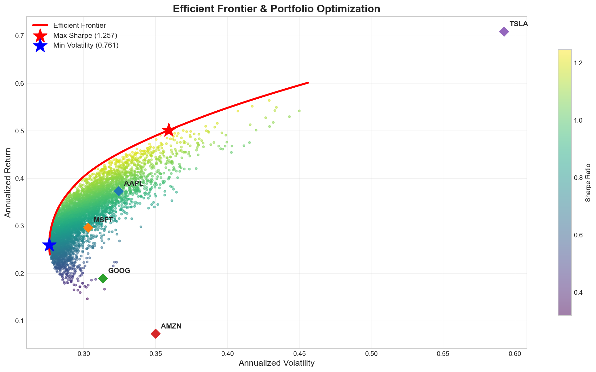
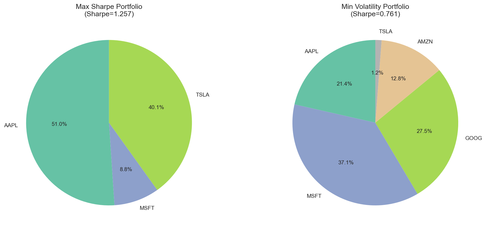
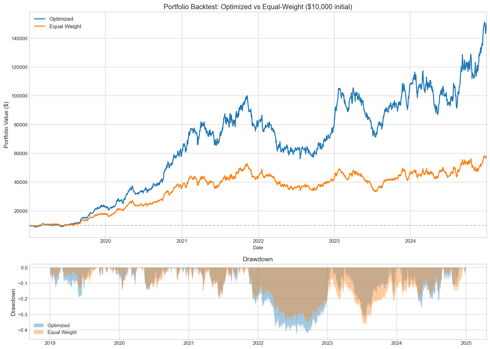
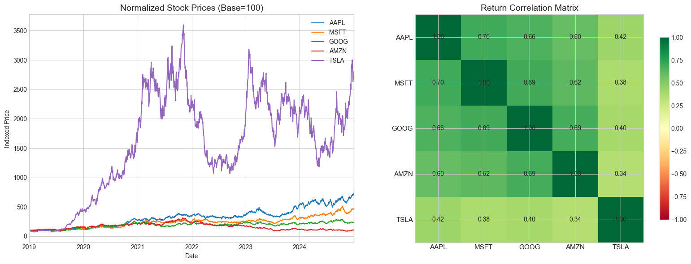

# 📈 Portfolio Optimizer — Modern Portfolio Theory

**Author:** Navya Neelamegam, School of Information Studies, Syracuse University

Optimize a stock portfolio using Modern Portfolio Theory with interactive web interface. Choose between synthesized or live market data, visualize efficient frontiers, and backtest optimized allocations.

---

## ✨ Features

- **📊 Dual Data Sources**: Synthesized data (3 market conditions) or live Yahoo Finance data
- **🎯 Optimization**: Maximum Sharpe Ratio & Minimum Volatility portfolios
- **📈 Visualizations**: Interactive Plotly charts for frontier, allocations, and backtest
- **💰 Backtest**: Historical performance vs equal-weight baseline
- **🌐 Web Interface**: Streamlit dashboard for real-time analysis

---

## Project Structure

```
Portfolio_Optimizer/
├── app.py                      # 🌐 Streamlit web application
├── generate_data.py            # 🎲 Synthetic data generation (bull/bear/sideways)
├── run_analysis.py             # 📊 Batch analysis script
├── notebook.ipynb              # 📓 Jupyter notebook
├── data/
│   ├── prices.csv              # Daily adjusted close prices
│   ├── returns.csv             # Daily returns
│   └── optimal_weights.csv     # Optimized portfolio weights
├── src/
│   ├── fetch_data.py           # Data fetching (live & synthetic)
│   ├── optimize.py             # Mean-variance optimization (scipy)
│   └── backtest.py             # Backtest engine
├── requirements.txt            # Python dependencies
└── README.md
```

## 🚀 Installation

```bash
# Install dependencies
pip install -r requirements.txt

# Or install individually
pip install streamlit plotly yfinance pandas numpy scipy
```

## 🎯 Usage

### Option 1: Web Dashboard (Recommended)

```bash
streamlit run app.py
```

Then open your browser to `http://localhost:8501`

**Features:**
- Toggle between **Synthesized** and **Live** data
- Choose market condition (Bull, Bear, Sideways)
- Select stocks and historical period
- Adjust optimization parameters
- View 4 tabs: Data Overview, Optimization, Allocation, Backtest

### Option 2: Command Line Analysis

```bash
# Generate synthetic data
python generate_data.py

# Run batch analysis
python run_analysis.py

# Or use Jupyter notebook
jupyter notebook notebook.ipynb
```

---

## Results

### 🏆 Maximum Sharpe Ratio Portfolio

| Metric | Value |
|---|---|
| **Sharpe Ratio** | **1.2569** |
| Expected Annual Return | 50.13% |
| Annual Volatility | 35.91% |

**Optimal Weights:**

| Ticker | Weight |
|---|---|
| AAPL | 51.05% |
| TSLA | 40.12% |
| MSFT | 8.84% |
| GOOG | 0.00% |
| AMZN | 0.00% |

### 🛡️ Minimum Volatility Portfolio

| Metric | Value |
|---|---|
| **Sharpe Ratio** | **0.7611** |
| Expected Annual Return | 26.01% |
| Annual Volatility | 27.60% |

**Optimal Weights:**

| Ticker | Weight |
|---|---|
| MSFT | 37.05% |
| GOOG | 27.47% |
| AAPL | 21.45% |
| AMZN | 12.82% |
| TSLA | 1.21% |

### 📊 Backtest Performance (2019–2024, $10,000 initial)

| Metric | Optimized | Equal Weight |
|---|---|---|
| Total Return | 1389.76% | 478.53% |
| Annualized Return | 54.53% | 32.69% |
| Annualized Volatility | 35.92% | 29.52% |
| **Sharpe Ratio** | **1.379** | **0.938** |
| Max Drawdown | -43.78% | -36.83% |

---

## Visualizations

### Efficient Frontier

5,000 randomly generated portfolios colored by Sharpe ratio, with the efficient frontier curve, max-Sharpe (★ red) and min-volatility (★ blue) optimal portfolios, and individual stock positions (◆).



### Portfolio Allocation



### Backtest: Optimized vs Equal-Weight



### Exploratory Analysis



---

## Methodology

### Mean-Variance Optimization

The optimizer uses **Markowitz Mean-Variance** framework:

1. **Inputs**: Daily returns → annualized mean returns (μ) and covariance matrix (Σ)
2. **Objective**: Maximize Sharpe Ratio = (R_p - R_f) / σ_p
3. **Constraints**: Weights sum to 1, no short selling (w_i ≥ 0)
4. **Solver**: `scipy.optimize.minimize` with SLSQP method
5. **Risk-free rate**: 5% (U.S. Treasury baseline)

### Efficient Frontier

The frontier is traced by solving for minimum volatility at each target return level across 100 equally-spaced return targets.

### Backtest

- Applies optimized weights to historical daily returns
- Computes cumulative portfolio value from $10,000 initial investment
- Compares against equal-weight (1/N) benchmark
- Reports annualized return, volatility, Sharpe ratio, and maximum drawdown

---

## Key Finance Insights

1. **Concentration in high-Sharpe assets**: The optimizer heavily weights AAPL (51%) and TSLA (40%) — the two stocks with the highest individual Sharpe ratios (0.997 and 1.113 respectively)

2. **Diversification reduces risk**: The min-volatility portfolio spreads across all 5 stocks, achieving 27.60% volatility vs 29.52% for equal-weight — a 6.5% risk reduction

3. **Risk-return tradeoff**: The max-Sharpe portfolio accepts higher volatility (35.91%) for substantially higher returns (50.13%), achieving a 1.26 Sharpe — well above the 1.0 threshold considered excellent

4. **AMZN underweight**: Amazon is excluded from the max-Sharpe portfolio due to its low Sharpe ratio (0.066) driven by high volatility relative to returns

5. **Backtest outperformance**: The optimized portfolio turned $10,000 into ~$149,000 vs ~$58,000 for equal-weight, a 2.5x improvement in total return with a 47% higher Sharpe ratio (1.379 vs 0.938)

6. **Drawdown cost**: Higher concentration comes at a cost — max drawdown of -43.78% vs -36.83% for equal-weight, reflecting the volatility tradeoff

---

## Technologies

- **Python** — Core language
- **NumPy / Pandas** — Data manipulation and linear algebra
- **SciPy** — Constrained optimization (`scipy.optimize.minimize`, SLSQP)
- **Matplotlib** — Visualizations (efficient frontier, backtest charts)
- **Jupyter** — Interactive notebook for exploration
